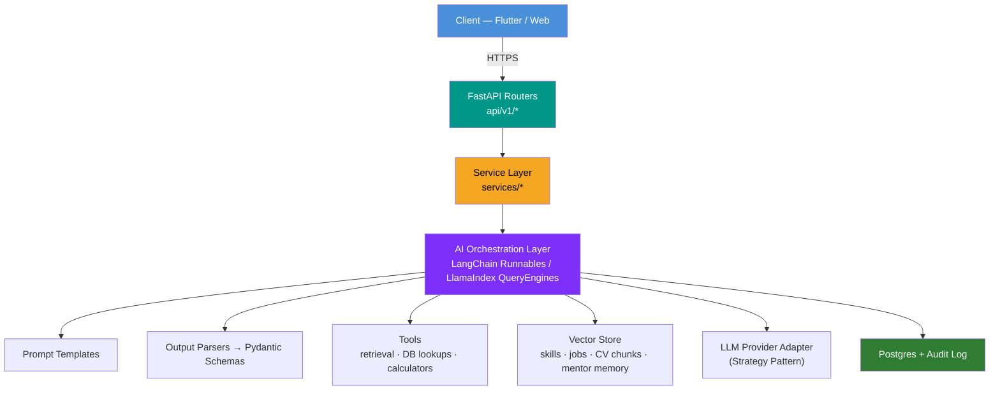
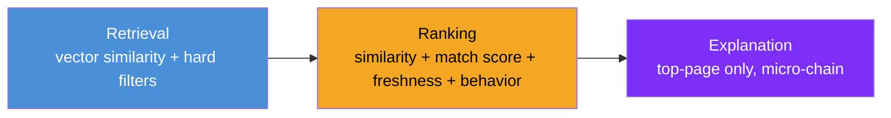
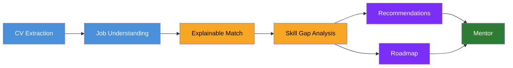

<div align="center">

# SkillMatch — AI Features Technical Report

### Career Intelligence Layer — Architecture & Design Reference


</div>

---

## How to Read This Report

Every feature below follows the same three-part structure, so the team can review, debate, and estimate consistently:

| Section | Purpose |
|---|---|
| **Why We Need This Feature** | The product/business justification |
| **What Is This Feature (Definition)** | A precise functional definition, independent of implementation |
| **How Will We Build It** | Concrete FastAPI + LangChain/LlamaIndex architecture and design pattern |

> Use this document as the agenda for the AI-team walkthrough — one feature per discussion block.

---

## Shared Architecture Skeleton

All AI features plug into one consistent pipeline so the codebase never forks into twelve different styles.



### Cross-Cutting Design Patterns

| Pattern | Where It's Used |
|---|---|
| **Strategy** | LLM provider adapter — swap OpenAI / Anthropic / local model without touching business logic |
| **Facade** | Each AI capability exposed as one class (e.g. `CVExtractionFacade`) hiding chain/agent complexity |
| **Repository** | All DB / vector-store access from AI code — chains never touch the ORM directly |
| **Chain of Responsibility** | Confidence and fallback handling: extraction → validation → human-review escalation |
| **Factory** | Building the right chain/agent variant per job (e.g. role-family prompt variants) |

**Non-negotiable rules:**
- All AI outputs are strict Pydantic models — parsed via `PydanticOutputParser` / `.with_structured_output()` (LangChain) or `PydanticProgram` (LlamaIndex). Never free-form string parsing.
- All non-trivial AI calls run as async background jobs — `BackgroundTasks` for light work, Celery/RQ + Redis for CV processing, job enrichment, and roadmap generation — with a pollable `status` field or notification on completion.

---

## Feature Map

| # | Feature | Phase | Core Pattern |
|---|---|:---:|---|
| 1 | [CV Profile Extraction](#1-cv-profile-extraction) | MVP | Chain of Responsibility |
| 2 | [Job Description Understanding](#2-job-description-understanding) | MVP | Tool-augmented Chain |
| 3 | [Explainable Job Match](#3-explainable-job-match) | MVP | Facade |
| 4 | [Skill Gap Analysis](#4-skill-gap-analysis) | MVP | Deterministic + LLM Overlay |
| 5 | [Personalized Job Recommendations](#5-personalized-job-recommendations) | MVP | Retrieval Pipeline |
| 6 | [AI Mentor Chatbot](#6-ai-mentor-chatbot) | MVP | Tool-Calling Agent |
| 7 | [Dynamic Career Roadmap](#7-dynamic-career-roadmap) | MVP | Factory + State Machine |
| 8 | [CV Improvement Assistant](#8-cv-improvement-assistant-phase-2) | Phase 2 | Strict Grounding |
| 9 | [Interview Preparation Coach](#9-interview-preparation-coach-phase-2) | Phase 2 | Dual Chain |
| 10 | [Application Strategy Guidance](#10-application-strategy-guidance-phase-2) | Phase 2 | Guarded Decision Chain |
| 11 | [Roadmap Progress Review](#11-roadmap-progress-review-phase-2) | Phase 2 | Scheduled Delta Review |
| 12 | [AI Data Quality Assistant](#12-ai-data-quality-assistant-for-admin) | MVP | Shared Escalation Contract |

---
---

## 1. CV Profile Extraction

### Why We Need This Feature
Every downstream AI feature — matching, gap analysis, recommendations, roadmap, mentor — depends on a structured, trustworthy candidate representation. Without reliable CV extraction, the whole product degrades to keyword search.

### What Is This Feature (Definition)
A pipeline that converts an uploaded CV (PDF/DOCX) into a structured candidate profile — skills, experience, education, projects, role history — with evidence spans and a confidence score per field, reviewable by the user before it affects matching.

### How Will We Build It

| Step | Implementation |
|---|---|
| Ingestion | `POST /cv/upload` stores the file, creates a `cv_processing` record (`status=queued`), dispatches a Celery task |
| Parsing | LlamaIndex `SimpleDirectoryReader` / `PDFReader` (or `pdfplumber`/`unstructured`) → raw text + layout chunks |
| Extraction Chain | `PromptTemplate` (few-shot) → LLM → `PydanticOutputParser[CVProfileSchema]`; each skill carries `source_text` and `confidence` |
| Confidence Handling | Chain of Responsibility — low-confidence items flagged `needs_review` and routed to the Admin AI Data Quality queue (feature 12) |
| Persistence | Repository writes structured profile to Postgres; raw evidence retained for traceability |
| Versioning | Re-uploads create a new CV version; diff logic decides what requires re-confirmation |
| API | `GET /cv/{id}/status` · `GET /cv/{id}/profile` · `POST /cv/{id}/confirm` |

---

## 2. Job Description Understanding

### Why We Need This Feature
Raw job descriptions vary widely in structure and vocabulary across sources. Matching, roadmaps, and mentor answers all need one normalized requirement representation, not raw text.

### What Is This Feature (Definition)
An extraction/normalization pipeline that turns a raw job description into a structured requirement profile: role family, seniority, required/preferred skills mapped to the canonical taxonomy, responsibilities, experience expectations, and constraints.

### How Will We Build It

- Triggered right after job normalization (ingestion pipeline) via an `enrich_job(job_id)` Celery task
- **Chain:** `PromptTemplate` → LLM → `PydanticOutputParser[JobRequirementSchema]`
- **Taxonomy Alignment Tool:** a LangChain `Tool` wrapping the Skills Repository — resolves extracted skill strings to canonical `skill_id`s via embedding similarity and alias lookup; unresolved terms are queued for admin taxonomy review
- **Batching and resilience:** queue-consumed batches; failed jobs retry with exponential backoff, isolated per source
- **Output:** persisted `job_requirements` table — consumed by matching, roadmap, and mentor, never re-derived ad hoc

---

## 3. Explainable Job Match

### Why We Need This Feature
A bare percentage score doesn't help a candidate act. SkillMatch's core value is explainability — what matched, what's missing, and why.

### What Is This Feature (Definition)
Compares a verified candidate profile against structured job requirements and returns matched strengths, missing/weak requirements, blockers, and a short natural-language explanation — not just a score.

### How Will We Build It

```
Deterministic Scorer (Python)  →  Structured Facts
        │
        ▼
PromptTemplate → LLM → PydanticOutputParser[MatchExplanationSchema]
        │
        ▼
MatchService.explain(candidate_id, job_id)   ← Facade
```

- **Deterministic layer first:** skill coverage, experience fit, and preference alignment computed in plain Python — fast, auditable, cheap
- **LLM layer:** reasons over the facts to produce the human-readable "why" and prioritize which gaps matter most
- **Caching:** keyed on `(profile_version, job_version)` — avoids recomputation on every screen open
- **API:** `GET /jobs/{id}/match` — powers the "AI Match Insight" screen

---

## 4. Skill Gap Analysis

### Why We Need This Feature
An unordered list of missing skills overwhelms the user. Gaps must be prioritized to drive the roadmap and mentor conversations.

### What Is This Feature (Definition)
Classifies missing/weak requirements from the match result into must-have vs. nice-to-have, ordered by impact on the target role.

### How Will We Build It

| Layer | Role |
|---|---|
| Deterministic scoring | Combines required-vs-preferred weight, frequency across the target-role job pool, and roadmap dependency count |
| LLM overlay | Reorders/annotates the ranking with a short rationale per gap → `PydanticOutputParser[SkillGapResultSchema]` |
| Guardrail | The LLM never invents gaps outside the deterministic set — fully auditable, no hallucinated requirements |
| Persistence | `skill_gaps` table feeds roadmap creation (7) and mentor context (6) |

---

## 5. Personalized Job Recommendations

### Why We Need This Feature
A ranked, explained feed is what turns an aggregated job list into perceived intelligence.

### What Is This Feature (Definition)
Ranks the job catalog using skills, target role, preferences, match quality, freshness, and behavior (saves/applies) — each result includes a short "recommended because…" reason.

### How Will We Build It



- **Retrieval:** candidate profile embedded once per version → LlamaIndex `VectorStoreIndex` (pgvector/FAISS); pre-filtered by hard constraints at the SQL layer for speed
- **Ranking:** deterministic blend of similarity, cached match score, freshness, and behavior — kept out of the LLM for latency and cost
- **Explanation:** the LLM only touches the top page of results → `PydanticOutputParser[RecommendationReasonSchema]`
- **API:** `GET /jobs/recommended` — cached feed, refreshed on profile change, new ingestion, or schedule

---

## 6. AI Mentor Chatbot

### Why We Need This Feature
This is the feature that turns insight into action — one place to ask "what should I do now?" and get an answer grounded in real data.

### What Is This Feature (Definition)
A context-aware conversational assistant grounded in profile, CV, target role, saved/applied jobs, skill gaps, and roadmap — answers questions, compares options, and proposes next actions, with visible history and graceful fallback.

### How Will We Build It

> This is an agent, not a single chain — it must decide which context it needs per question.

| Component | Detail |
|---|---|
| Tools | `get_profile` · `get_target_role` · `get_saved_applied_jobs` · `get_skill_gaps` · `get_roadmap_state` · `get_job_details(job_id)` |
| Memory | Short-term via `RunnableWithMessageHistory`; long-term facts summarized periodically and stored as durable rows |
| Guardrails | System prompt encodes "no fabricated qualifications, no guaranteed-hire claims" plus a post-generation validator chain |
| Fallback | Missing context (e.g. no roadmap) — the mentor states this explicitly rather than inventing an answer |
| API | `POST /mentor/message` (SSE streaming) · `GET /mentor/history` · `GET /mentor/suggested-prompts` |

---

## 7. Dynamic Career Roadmap

### Why We Need This Feature
A flat gap list isn't actionable. Candidates need a sequenced plan that adapts as they progress or change target role.

### What Is This Feature (Definition)
A generated structure — phases, milestones, weekly actions, progress state, and rationale — built from prioritized skill gaps toward a target role, recalculated on change.

### How Will We Build It

- **Generation chain:** `skill_gaps` + target role metadata → `PydanticOutputParser[RoadmapSchema]`; every phase must cite the gap it addresses (the parser rejects ungrounded output)
- **Factory:** `RoadmapChainFactory.for_role_family(role_family)` — backend/data/frontend roadmaps differ structurally
- **State machine:** `not_started → in_progress → completed` per task/milestone — persisted, never silently overwritten
- **Adaptation:** an event listener (new skill, target change, milestone complete) enqueues a "recompute priorities" job in update mode, not a full rebuild
- **API:** `GET /roadmap` · `POST /roadmap/tasks/{id}/complete` · `POST /roadmap/refresh`

---

## 8. CV Improvement Assistant (Phase 2)

### Why We Need This Feature
Candidates often lose opportunities to weak framing, not missing skills. This turns gap analysis into truthful editing help.

### What Is This Feature (Definition)
Compares the CV against a target job and suggests evidence-based improvements — clearer bullets, missing-but-already-earned keywords, stronger project framing — without inventing experience.

### How Will We Build It

> Strict grounding pattern — the chain only sees the user's existing structured evidence and the job requirements.

- Every suggestion in `CVImprovementSchema` must cite an `evidence_id`
- A validator step fact-checks that suggested bullets only reuse terms present in evidence (generate → fact-check → return/discard)
- **API:** `POST /cv/improve?job_id=`

---

## 9. Interview Preparation Coach (Phase 2)

### Why We Need This Feature
Turns skill gaps into a concrete, practiceable output instead of vague "prepare for the interview" advice.

### What Is This Feature (Definition)
Generates role/job-specific practice questions and topic priorities, plus structured feedback on submitted answers against role-relevant criteria.

### How Will We Build It

| Chain | Input → Output |
|---|---|
| Question Generation | Job requirements + skill gaps → `InterviewQuestionSetSchema` (ranked topics with sample questions) |
| Feedback | Question + user answer + role criteria → `FeedbackSchema` (strengths, gaps, suggested improvement) |

Both reuse the existing `job_requirements`/`skill_gaps` repositories — no duplicated extraction logic.
**API:** `GET /interview/prep?job_id=` · `POST /interview/answer`

---

## 10. Application Strategy Guidance (Phase 2)

### Why We Need This Feature
Candidates need help deciding when to apply, not just what's missing — this closes the loop from analysis to action.

### What Is This Feature (Definition)
Advice attached to a job: apply now / improve gaps first / prioritize another role — framed strictly as advice, never a hiring guarantee.

### How Will We Build It

- Consumes the existing `MatchExplanationSchema` and `SkillGapResultSchema` — no re-analysis
- Output: `StrategySchema` with enum `recommendation: {apply_now, improve_first, prioritize_alternative}` plus `reasoning`
- **Guardrail:** a regex/keyword validator rejects probability or guarantee language before it reaches the client
- **API:** `GET /jobs/{id}/strategy`

---

## 11. Roadmap Progress Review (Phase 2)

### Why We Need This Feature
A roadmap that never re-evaluates against real progress goes stale. This keeps it a living plan.

### What Is This Feature (Definition)
Periodically compares completed items, new CV evidence, and applications against the target role, producing a progress summary and the next highest-value action.

### How Will We Build It

- Scheduled (Celery beat) or event-triggered (milestone complete, new CV, application outcome)
- **Chain:** a `RoadmapDelta` object (built in Python) → LLM → `ProgressReviewSchema` → calls roadmap "update mode" (feature 7) if needed
- **Facade:** `RoadmapService.review_and_adapt(candidate_id)`
- **API:** `GET /roadmap/progress-review` (also surfaced as a mentor prompt or notification)

---

## 12. AI Data Quality Assistant for Admin

### Why We Need This Feature
AI will sometimes be wrong or ambiguous. The platform must never silently trust low-confidence output.

### What Is This Feature (Definition)
Flags low-confidence skill extraction, ambiguous job categories, incomplete descriptions, and duplicates for human review, with reason and confidence attached. Human approval is the final gate.

### How Will We Build It

> Not a separate model — this is the shared escalation branch already wired into features 1, 2, and 5.

- **Central review queue:** `ReviewQueueRepository.push_for_review(item_type, payload, confidence, reason)` — any chain can push, decoupling "who flags" from "who reviews"
- **Admin API:** `GET /admin/ai-review-queue?type=` · `POST /admin/ai-review-queue/{id}/resolve` (writes to the audit log)
- **Future hook:** resolved corrections stored for future few-shot examples or fine-tuning — not required for MVP

---
---

## Implementation Order



1. Build the shared skeleton first — provider adapter, Pydantic conventions, review-queue repository, background job runner
2. Implement in the dependency order shown above — later features consume earlier ones' persisted output rather than recomputing it
3. Maintain an evaluation test set (representative CV/job pairs with expected reasoning) from day one — run it on every chain change to catch prompt regressions before the demo

---

<div align="center">

**Guiding Principle**

> "The best AI demo is not 'Match = 82%'. It is: 'You match 7 of 9 important requirements; testing and CI/CD are the main gaps; here are the jobs you should prioritize, the CV changes supported by your actual experience, and a four-week roadmap to close those gaps.'"

</div>
