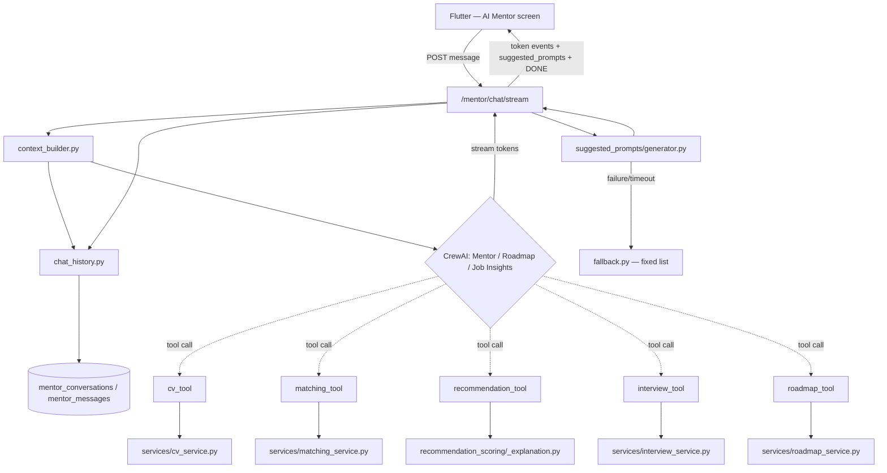

# Master Prompt — AI Mentor Feature (SkillMatch / AI-Serv5)
### Ready to paste directly into Antigravity

---

## Final Decision

**Framework used: CrewAI** (not LangGraph).

**Reason:** Our priority is ease of debugging and tracking at deployment time — CrewAI provides:
- Detailed logging for every step (reasoning + tool calls + output) out of the box, with no extra setup.
- Built-in OpenTelemetry tracing support (OpenInference / OpenLLMetry / traceAI) for production monitoring.
- Verbose mode that prints every step live during development.
- Built-in memory inspection (short-term / long-term) that you can examine directly.
- A much faster learning curve than LangGraph, which matters for delivery speed.

> **Note:** We lose some of the state-machine control precision that LangGraph offers, but that's an acceptable trade-off for easier monitoring and diagnostics in production — which is the agreed-upon priority.

---

##  Full Task Context (Copy this section as System Context for Antigravity)

```
You are working on AI-Serv5, the backend for the SkillMatch platform
(a smart job-discovery + AI-powered career mentoring platform).

The project already has an existing Python/FastAPI structure:

AI-Serv5/
├── scripts/
├── src/
│   ├── ai/
│   ├── api/
│   ├── core/
│   ├── cv_extractor/
│   ├── db/
│   ├── integrations/
│   ├── job_extractor/
│   ├── middleware/
│   ├── models/
│   ├── schemas/
│   └── services/
│       ├── cv_service.py
│       ├── interview_service.py
│       ├── matching_service.py
│       ├── recommendation_explanation.py
│       └── recommendation_scoring.py

The rule that must never be broken, no matter what:
- The logic inside src/services/* must not be touched, modified, or duplicated.
- The task at hand is to build an "AI Mentor" as a Feature Agent only, which
  uses the existing services as Tools (direct calls), without rewriting
  their logic.
- Any new file goes inside src/ai/, src/models/, src/schemas/, src/api/
  following the same naming pattern already used in the project. Moving or
  deleting anything existing is forbidden.
- The framework used to build the Agents is CrewAI exclusively.

In short, what's required:
1. Build 3 CrewAI Agents: Mentor Agent, Roadmap Agent, Job Insights Agent.
2. Each Agent is equipped with thin tools (thin wrappers) around the
   existing services/*.
3. Real memory: every conversation and every message is stored in the DB
   (only two new tables).
4. Live streaming of the response via an SSE endpoint in FastAPI.
5. After each response, generate 3 "Suggested Prompts" (follow-up questions)
   using a fast model (gpt-4o-mini) as Structured Output via Pydantic, with a
   guaranteed fallback if generation fails or exceeds the time limit.
```

---

## 📂 Full File Structure to be Generated (Final Diff)

```diff
AI-Serv5/
├── scripts/                              (unchanged)
├── src/
│   ├── ai/
+   │   ├── crew/
+   │   │   ├── __init__.py
+   │   │   ├── agents.py                  # The 3 Agents (Mentor/Roadmap/JobInsights)
+   │   │   ├── tasks.py                   # The Tasks associated with each Agent
+   │   │   ├── crew.py                    # Assembles the Crew + the streaming function
+   │   │   └── tools/
+   │   │       ├── __init__.py
+   │   │       ├── cv_tool.py             # Wraps services/cv_service.py
+   │   │       ├── matching_tool.py       # Wraps services/matching_service.py
+   │   │       ├── recommendation_tool.py # Wraps recommendation_scoring/_explanation
+   │   │       ├── interview_tool.py      # Wraps services/interview_service.py
+   │   │       └── roadmap_tool.py        # Wraps services/roadmap_service.py (if it doesn't exist, add it following the same pattern as the other services)
+   │   ├── memory/
+   │   │   ├── __init__.py
+   │   │   ├── chat_history.py            # Reads/writes conversation history from the DB
+   │   │   └── context_builder.py         # Assembles the user context before sending it to the Crew
+   │   └── suggested_prompts/
+   │       ├── __init__.py
+   │       ├── schema.py                  # SuggestedPromptsSchema (Pydantic)
+   │       ├── agent_context.py           # AgentType Enum + resolve_active_agent
+   │       ├── generator.py               # Generates the questions with a fast model
+   │       └── fallback.py                # Timeout + exception handling
│   ├── api/
+   │   └── mentor_routes.py               # POST /mentor/chat/stream (SSE)
│   ├── core/                             (unchanged)
│   ├── cv_extractor/                     (unchanged)
│   ├── db/                               (unchanged)
│   ├── integrations/                     (unchanged)
│   ├── job_extractor/                    (unchanged)
│   ├── middleware/                       (unchanged — the same auth will be used in mentor_routes)
│   ├── models/
+   │   ├── mentor_conversation.py         # Conversations table
+   │   └── mentor_message.py              # Messages table
│   ├── schemas/
+   │   └── mentor_schema.py               # MentorChatRequest / MentorChatEvent
│   └── services/                         (no changes at all)
+       └── roadmap_service.py             # Suggested addition if it doesn't already exist
└── tests/
+   └── test_suggested_prompts.py          # Unit tests for the fallback mechanism
```

---

## 🗺️ System Flow Map



---

## PHASE 1 — Building the Core Crew (Agents + Tools + Memory)

### Task 1.1 — Tools: a wrapper around each existing service

**`src/ai/crew/tools/cv_tool.py`**
```python
from crewai.tools import tool
from src.services import cv_service


@tool("Get Candidate CV Profile")
def get_cv_profile_tool(user_id: str) -> dict:
    """
    Returns the profile extracted from the CV: skills, experience, projects,
    and education. Use this as soon as you need to know the user's
    background before making any suggestion.
    """
    return cv_service.get_extracted_profile(user_id)
```

**`src/ai/crew/tools/matching_tool.py`**
```python
from crewai.tools import tool
from src.services import matching_service


@tool("Get Job Match & Skill Gaps")
def get_job_match_tool(user_id: str, job_id: str) -> dict:
    """
    Calculates the match percentage between the user and a specific job, and
    returns the matching skills and the missing gaps. Use this when the user
    asks about a specific job.
    """
    return matching_service.calculate_match(user_id=user_id, job_id=job_id)
```

**`src/ai/crew/tools/recommendation_tool.py`**
```python
from crewai.tools import tool
from src.services import recommendation_scoring, recommendation_explanation


@tool("Get Personalized Job Recommendations")
def get_job_recommendations_tool(user_id: str, limit: int = 5) -> list[dict]:
    """
    Returns the top candidate jobs for the user, ranked by match. Use this
    when the user asks for general job suggestions.
    """
    return recommendation_scoring.get_top_recommendations(user_id=user_id, limit=limit)


@tool("Explain Why a Job Was Recommended")
def explain_recommendation_tool(user_id: str, job_id: str) -> str:
    """
    Explains why a specific job was recommended to the user. Use this when
    the user asks "why was this one recommended to me specifically?".
    """
    return recommendation_explanation.explain(user_id=user_id, job_id=job_id)
```

**`src/ai/crew/tools/interview_tool.py`**
```python
from crewai.tools import tool
from src.services import interview_service


@tool("Get Interview Preparation")
def get_interview_prep_tool(user_id: str, job_id: str) -> dict:
    """
    Generates interview questions and study topics related to a specific job
    and the user's gaps. Use this when interview preparation is requested.
    """
    return interview_service.generate_prep(user_id=user_id, job_id=job_id)
```

**`src/ai/crew/tools/roadmap_tool.py`**
```python
from crewai.tools import tool
from src.services import roadmap_service


@tool("Get or Update Career Roadmap")
def get_roadmap_tool(user_id: str) -> dict:
    """
    Returns the user's current roadmap: stages, milestones, and weekly tasks.
    Use this when the user asks about their plan or their next step.
    """
    return roadmap_service.get_current_roadmap(user_id=user_id)
```

**Definition of Done (Task 1.1):**
- [ ] Every file imports without errors.
- [ ] The docstring in each tool is precise and aimed at the LLM (this isn't an ordinary comment — it's read as part of the prompt).
- [ ] There is no real business logic inside the tools files — all of them are direct calls only.

---

### Task 1.2 — The Agents

**`src/ai/crew/agents.py`**
```python
from crewai import Agent

from src.ai.crew.tools.cv_tool import get_cv_profile_tool
from src.ai.crew.tools.matching_tool import get_job_match_tool
from src.ai.crew.tools.recommendation_tool import (
    get_job_recommendations_tool,
    explain_recommendation_tool,
)
from src.ai.crew.tools.interview_tool import get_interview_prep_tool
from src.ai.crew.tools.roadmap_tool import get_roadmap_tool


mentor_agent = Agent(
    role="Mentor Agent",
    goal=(
        "Help the user make practical career decisions based on their real "
        "data (CV, jobs they've viewed, their roadmap) — without inventing "
        "any information not present in the available tools."
    ),
    backstory=(
        "You are an expert career mentor inside the SkillMatch platform. "
        "You don't give generic advice — every response of yours is based "
        "on real data fetched from the tools available to you."
    ),
    tools=[
        get_cv_profile_tool,
        get_job_match_tool,
        get_job_recommendations_tool,
        explain_recommendation_tool,
        get_interview_prep_tool,
        get_roadmap_tool,
    ],
    memory=True,
    verbose=True,
    allow_delegation=False,
)

roadmap_agent = Agent(
    role="Roadmap Agent",
    goal="Build and update a practical, staged career plan based on real skill gaps.",
    backstory="A specialist in building actionable career-development plans, broken into stages and weekly goals.",
    tools=[get_cv_profile_tool, get_roadmap_tool],
    memory=True,
    verbose=True,
    allow_delegation=False,
)

job_insights_agent = Agent(
    role="Job Insights Agent",
    goal="Explain how well-suited the user is for a specific job and whether they should apply now or wait.",
    backstory="A specialist in analyzing the fit between candidates and jobs with transparency and clear evidence.",
    tools=[get_job_match_tool, explain_recommendation_tool],
    memory=True,
    verbose=True,
    allow_delegation=False,
)
```

**Definition of Done (Task 1.2):**
- [ ] Every Agent has precisely scoped Tools (no Agent carries every tool).
- [ ] `allow_delegation=False` on all three — so routing is decided explicitly in `tasks.py`, not by the Agents deciding among themselves.
- [ ] `verbose=True` is enabled on all Agents (needed for debugging during development; turn it off in production if the logs get too large).

---

### Task 1.3 — Tasks + Crew

**`src/ai/crew/tasks.py`**
```python
from crewai import Task
from src.ai.crew.agents import mentor_agent, roadmap_agent, job_insights_agent


def build_mentor_task(user_message: str, context: dict) -> Task:
    return Task(
        description=(
            f"User message: {user_message}\n\n"
            f"Available context: {context}\n\n"
            "Answer using only the available tools. If you need data that "
            "isn't in the context, use the appropriate tool."
        ),
        expected_output="A direct, useful response to the user based on real data.",
        agent=mentor_agent,
    )


def build_roadmap_task(user_message: str, context: dict) -> Task:
    return Task(
        description=f"User message: {user_message}\n\nAvailable context: {context}",
        expected_output="A plan or update to the roadmap based on real gaps.",
        agent=roadmap_agent,
    )


def build_job_insights_task(user_message: str, context: dict) -> Task:
    return Task(
        description=f"User message: {user_message}\n\nAvailable context: {context}",
        expected_output="A clear compatibility analysis with the job mentioned.",
        agent=job_insights_agent,
    )
```

**`src/ai/crew/crew.py`**
```python
from crewai import Crew, Process

from src.ai.crew.agents import mentor_agent, roadmap_agent, job_insights_agent
from src.ai.crew.tasks import (
    build_mentor_task,
    build_roadmap_task,
    build_job_insights_task,
)
from src.ai.suggested_prompts.agent_context import AgentType


def _classify_intent(user_message: str) -> AgentType:
    """
    A lightweight initial classification (rule-based or a fast model) to
    determine who should respond. Start with simple rule-based logic, and
    it can later be switched to a small classification model if needed.
    """
    lowered = user_message.lower()
    if any(k in lowered for k in ["roadmap", "plan", "milestone", "stage"]):
        return AgentType.ROADMAP
    if any(k in lowered for k in ["this job", "apply", "match", "fit"]):
        return AgentType.JOB_INSIGHTS
    return AgentType.MENTOR


async def run_mentor_crew_stream(user_message: str, context: dict):
    """
    Determines the appropriate Agent, runs its Task inside a separate Crew
    (so the streaming source is clear), and yields (token, agent_type)
    incrementally.
    """
    intent = _classify_intent(user_message)

    task_builders = {
        AgentType.MENTOR: build_mentor_task,
        AgentType.ROADMAP: build_roadmap_task,
        AgentType.JOB_INSIGHTS: build_job_insights_task,
    }
    task = task_builders[intent](user_message, context)

    crew = Crew(
        agents=[task.agent],
        tasks=[task],
        process=Process.sequential,
        verbose=True,
    )

    # CrewAI supports streaming either via kickoff with a callback or via
    # the underlying LLM client used internally (depending on the CrewAI
    # version). The following is simplified and assumes a supported stream
    # function exists — if the version used doesn't support direct
    # streaming, use a regular kickoff() and split the output into chunks
    # manually.
    async for token in crew.kickoff_stream():
        yield token, intent

    yield "", intent  # end-of-stream signal to guarantee agent_type is sent even if the response is empty
```

**Definition of Done (Task 1.3):**
- [ ] `_classify_intent` returns the correct `AgentType` for clear-cut cases, with `MENTOR` as a safe default.
- [ ] `run_mentor_crew_stream` continuously yields `(token, agent_type)` so `resolve_active_agent`/the route can correctly build the `suggested_prompts`.
- [ ] There's a clear comment in the code if `kickoff_stream()` doesn't exist in the CrewAI version actually used in the project — along with the fallback (splitting up the regular `kickoff()`).

---

### Task 1.4 — Memory / Chat History

**`src/ai/memory/chat_history.py`**
```python
from src.db.session import get_session
from src.models.mentor_message import MentorMessage


async def get_recent_messages(conversation_id: str, limit: int = 10) -> list[dict]:
    async with get_session() as session:
        rows = await session.execute(
            MentorMessage.select()
            .where(MentorMessage.conversation_id == conversation_id)
            .order_by(MentorMessage.created_at.desc())
            .limit(limit)
        )
        return [row.to_dict() for row in reversed(rows.fetchall())]


async def save_turn(conversation_id: str, user_message: str, assistant_message: str) -> None:
    async with get_session() as session:
        session.add_all(
            [
                MentorMessage(conversation_id=conversation_id, role="user", content=user_message),
                MentorMessage(conversation_id=conversation_id, role="assistant", content=assistant_message),
            ]
        )
        await session.commit()
```

**`src/ai/memory/context_builder.py`**
```python
from src.ai.memory.chat_history import get_recent_messages
from src.ai.crew.tools.cv_tool import get_cv_profile_tool


async def build_mentor_context(user_id: str, conversation_id: str) -> dict:
    recent_messages = await get_recent_messages(conversation_id)
    cv_profile = get_cv_profile_tool.run(user_id=user_id)
    return {"recent_messages": recent_messages, "cv_summary": cv_profile}
```

**`src/models/mentor_conversation.py`**
```python
from sqlalchemy import Column, String, DateTime, func
from src.db.base import Base


class MentorConversation(Base):
    __tablename__ = "mentor_conversations"

    id = Column(String, primary_key=True)
    user_id = Column(String, nullable=False, index=True)
    active_agent = Column(String, nullable=True)
    created_at = Column(DateTime, server_default=func.now())
    updated_at = Column(DateTime, server_default=func.now(), onupdate=func.now())
```

**`src/models/mentor_message.py`**
```python
from sqlalchemy import Column, String, Text, DateTime, func
from src.db.base import Base


class MentorMessage(Base):
    __tablename__ = "mentor_messages"

    id = Column(String, primary_key=True)
    conversation_id = Column(String, nullable=False, index=True)
    role = Column(String, nullable=False)  # "user" | "assistant" | "tool"
    content = Column(Text, nullable=False)
    tool_name = Column(String, nullable=True)
    created_at = Column(DateTime, server_default=func.now())
```

**Definition of Done (Task 1.4):**
- [ ] Both tables get an actual migration (Alembic or whatever migration tool is used in the project) — not just the model class.
- [ ] `get_recent_messages` returns messages in ascending chronological order (oldest first) so they're placed correctly in the context.
- [ ] If `src/db/base.py` uses an ORM other than SQLAlchemy, the syntax is adjusted accordingly, keeping the same field names.

---

## PHASE 2 — Suggested Prompts Feature

### Task 2.1 — Schema

**`src/ai/suggested_prompts/schema.py`**
```python
from typing import List
from pydantic import BaseModel, Field, field_validator


class SuggestedPromptsSchema(BaseModel):
    """The shape of the LLM output when generating follow-up questions after each response."""

    prompts: List[str] = Field(
        default_factory=list,
        max_length=3,
        description=(
            "A list of 1 to 3 follow-up questions in first-person phrasing "
            "(e.g., 'How can I...?', 'Could you suggest...?'). Each question "
            "is short (under 15 words), based exclusively on the content of "
            "the last response, and must not repeat the same idea or be a "
            "generic question unrelated to the context."
        ),
    )

    @field_validator("prompts")
    @classmethod
    def enforce_max_three(cls, v: List[str]) -> List[str]:
        return v[:3]
```

### Task 2.2 — Agent Context & Intent Identification

**`src/ai/suggested_prompts/agent_context.py`**
```python
from enum import Enum
from pydantic import BaseModel


class AgentType(str, Enum):
    MENTOR = "Mentor Agent"
    ROADMAP = "Roadmap Agent"
    JOB_INSIGHTS = "Job Insights Agent"


class AgentContext(BaseModel):
    agent_type: AgentType
    last_output: str
    conversation_id: str
    user_id: str


AGENT_PROMPT_INSTRUCTIONS: dict[AgentType, str] = {
    AgentType.MENTOR: (
        "Focus the questions on: practical career advice, a specific next "
        "step, or a request for clarification on something mentioned in the "
        "Mentor's response."
    ),
    AgentType.ROADMAP: (
        "Focus the questions on: details of the upcoming milestone, "
        "suggested learning resources, or adjusting the roadmap's "
        "priorities."
    ),
    AgentType.JOB_INSIGHTS: (
        "Focus the questions on: details of the skill gap, the decision to "
        "apply now vs. wait, or other similar jobs."
    ),
}
```
> **Note:** `AgentType` is now a single shared source between `crew.py` (determining who responds) and `suggested_prompts` (determining the type of questions) — instead of duplicating it in two places.

### Task 2.3 — Dynamic Prompts Generator

**`src/ai/suggested_prompts/generator.py`**
```python
import instructor
from openai import AsyncOpenAI

from .schema import SuggestedPromptsSchema
from .agent_context import AgentType, AGENT_PROMPT_INSTRUCTIONS

_client = instructor.from_openai(AsyncOpenAI())
FAST_MODEL = "gpt-4o-mini"

SYSTEM_PROMPT = """
You are an assistant specialized in generating follow-up questions for
SkillMatch platform users, based on the last response they received from one
of the AI Agents. Your only job is to return a list of short first-person
questions, with no extra text or explanation.
"""


async def generate_suggested_prompts(
    agent_type: AgentType, agent_answer: str
) -> SuggestedPromptsSchema:
    agent_guidance = AGENT_PROMPT_INSTRUCTIONS[agent_type]
    user_prompt = f"""
Agent type: {agent_type.value}
Specific guidance: {agent_guidance}

Last response from the Agent:
---
{agent_answer}
---

Generate 3 appropriate follow-up questions per the conditions above.
"""
    return await _client.chat.completions.create(
        model=FAST_MODEL,
        response_model=SuggestedPromptsSchema,
        messages=[
            {"role": "system", "content": SYSTEM_PROMPT},
            {"role": "user", "content": user_prompt},
        ],
        max_tokens=200,
        temperature=0.4,
    )
```

### Task 2.4 — Fallback & Error Handling

**`src/ai/suggested_prompts/fallback.py`**
```python
import asyncio
import logging
from typing import List

from .agent_context import AgentType
from .generator import generate_suggested_prompts

logger = logging.getLogger("suggested_prompts")

DEFAULT_FALLBACK_PROMPTS: dict[AgentType, List[str]] = {
    AgentType.MENTOR: [
        "What's the most important practical step I should take this week?",
        "Can you explain in more detail how to develop this skill?",
        "What are the most likely interview questions in this field?",
    ],
    AgentType.ROADMAP: [
        "What's the most important milestone I should start with?",
        "Can you suggest learning resources for a specific skill?",
        "Can I adjust the roadmap's priorities?",
    ],
    AgentType.JOB_INSIGHTS: [
        "What's my biggest skill gap relative to this job?",
        "Should I apply now or wait?",
        "Are there other similar jobs that would suit me?",
    ],
}


async def get_fallback_with_timeout(
    agent_type: AgentType, agent_answer: str, timeout_seconds: float = 2.5
) -> List[str]:
    try:
        result = await asyncio.wait_for(
            generate_suggested_prompts(agent_type, agent_answer),
            timeout=timeout_seconds,
        )
        if not result.prompts:
            raise ValueError("Empty prompts returned from LLM")
        return result.prompts
    except Exception as e:
        logger.warning(
            "Suggested prompts failed for agent=%s, reason=%s. Using fallback.",
            agent_type.value, str(e),
        )
        return DEFAULT_FALLBACK_PROMPTS[agent_type]
```

**`tests/test_suggested_prompts.py`**
```python
import asyncio
import pytest
from unittest.mock import patch, AsyncMock

from src.ai.suggested_prompts.agent_context import AgentType
from src.ai.suggested_prompts.schema import SuggestedPromptsSchema
from src.ai.suggested_prompts.fallback import (
    get_fallback_with_timeout,
    DEFAULT_FALLBACK_PROMPTS,
)


@pytest.mark.asyncio
async def test_fallback_triggers_on_timeout():
    async def slow(*a, **k):
        await asyncio.sleep(5)

    with patch("src.ai.suggested_prompts.fallback.generate_suggested_prompts", side_effect=slow):
        result = await get_fallback_with_timeout(AgentType.MENTOR, "x", timeout_seconds=0.1)
        assert result == DEFAULT_FALLBACK_PROMPTS[AgentType.MENTOR]


@pytest.mark.asyncio
async def test_fallback_triggers_on_exception():
    with patch(
        "src.ai.suggested_prompts.fallback.generate_suggested_prompts",
        new=AsyncMock(side_effect=RuntimeError("LLM error")),
    ):
        result = await get_fallback_with_timeout(AgentType.ROADMAP, "x")
        assert result == DEFAULT_FALLBACK_PROMPTS[AgentType.ROADMAP]


@pytest.mark.asyncio
async def test_successful_generation():
    mocked = SuggestedPromptsSchema(prompts=["q1", "q2", "q3"])
    with patch(
        "src.ai.suggested_prompts.fallback.generate_suggested_prompts",
        new=AsyncMock(return_value=mocked),
    ):
        result = await get_fallback_with_timeout(AgentType.MENTOR, "x")
        assert result == ["q1", "q2", "q3"]


@pytest.mark.asyncio
async def test_never_raises():
    with patch(
        "src.ai.suggested_prompts.fallback.generate_suggested_prompts",
        new=AsyncMock(side_effect=TimeoutError()),
    ):
        try:
            result = await get_fallback_with_timeout(AgentType.MENTOR, "x")
        except Exception:
            pytest.fail("get_fallback_with_timeout must swallow any exception")
        assert len(result) == 3
```

**Definition of Done (Phase 2):**
- [ ] `pytest -v tests/test_suggested_prompts.py` passes entirely.
- [ ] `get_fallback_with_timeout` can never raise an exception outward.
- [ ] The log records a `warning` every time the fallback kicks in, so the failure rate can be monitored later.

---

## PHASE 3 — Final Integration: Schema + API Route

**`src/schemas/mentor_schema.py`**
```python
from pydantic import BaseModel


class MentorChatRequest(BaseModel):
    message: str
    conversation_id: str
    user_id: str


class MentorChatEvent(BaseModel):
    type: str  # "token" | "suggested_prompts" | "error"
    content: str | None = None
    agent: str | None = None
    prompts: list[str] | None = None
```

**`src/api/mentor_routes.py`**
```python
import json
from fastapi import APIRouter, Depends
from fastapi.responses import StreamingResponse

from src.schemas.mentor_schema import MentorChatRequest
from src.ai.memory.context_builder import build_mentor_context
from src.ai.memory.chat_history import save_turn
from src.ai.crew.crew import run_mentor_crew_stream
from src.ai.suggested_prompts.fallback import get_fallback_with_timeout
from src.middleware.auth import get_current_user

router = APIRouter()


def sse_event(data: dict) -> str:
    return f"data: {json.dumps(data, ensure_ascii=False)}\n\n"


@router.post("/mentor/chat/stream")
async def mentor_chat_stream(
    payload: MentorChatRequest,
    current_user=Depends(get_current_user),
):
    context = await build_mentor_context(payload.user_id, payload.conversation_id)

    async def generator():
        full_answer = ""
        active_agent_type = None

        async for token, agent_type in run_mentor_crew_stream(payload.message, context):
            if token:
                full_answer += token
                yield sse_event({"type": "token", "content": token})
            active_agent_type = agent_type

        prompts = await get_fallback_with_timeout(active_agent_type, full_answer)
        yield sse_event(
            {
                "type": "suggested_prompts",
                "agent": active_agent_type.value,
                "prompts": prompts,
            }
        )

        await save_turn(payload.conversation_id, payload.message, full_answer)
        yield "data: [DONE]\n\n"

    return StreamingResponse(generator(), media_type="text/event-stream")
```

**Definition of Done (Phase 3):**
- [ ] The endpoint is protected by the same `get_current_user` middleware used across the rest of the API.
- [ ] Order of events in the stream: `token` (repeated) → `suggested_prompts` (once) → `[DONE]`.
- [ ] `save_turn` runs **after** all events have been sent, not before, so it doesn't delay the streaming.

---

## ✅ Final Integration Checklist

| # | Check | Status |
|---|---|---|
| 1 | `pip install crewai instructor openai fastapi pytest pytest-asyncio` added to `requirements.txt` | ☐ |
| 2 | An actual migration for the `mentor_conversations` and `mentor_messages` tables | ☐ |
| 3 | `roadmap_service.py` exists or was added following the same pattern as the other `services/*` | ☐ |
| 4 | Manual test on `/mentor/chat/stream`, confirming the event order (token → suggested_prompts → DONE) | ☐ |
| 5 | All unit tests in `test_suggested_prompts.py` pass | ☐ |
| 6 | OpenTelemetry tracing (OpenInference/OpenLLMetry) enabled on top of the Crew before deployment | ☐ |
| 7 | Review confirming there is no business-logic line inside `src/ai/` — everything is just calls to `services/*` | ☐ |

---

## 🚀 Execution Steps in Antigravity (in order)

1. Paste the System Context block above as the first message/instructions for the project.
2. Execute **Phase 1** in full (Tasks 1.1 → 1.4) and confirm every Definition of Done before moving on.
3. Execute **Phase 2** in full (Tasks 2.1 → 2.4), and actually run the unit tests, not just write them.
4. Execute **Phase 3** for the final integration.
5. Review the full Integration Checklist before considering the feature ready for deployment.
